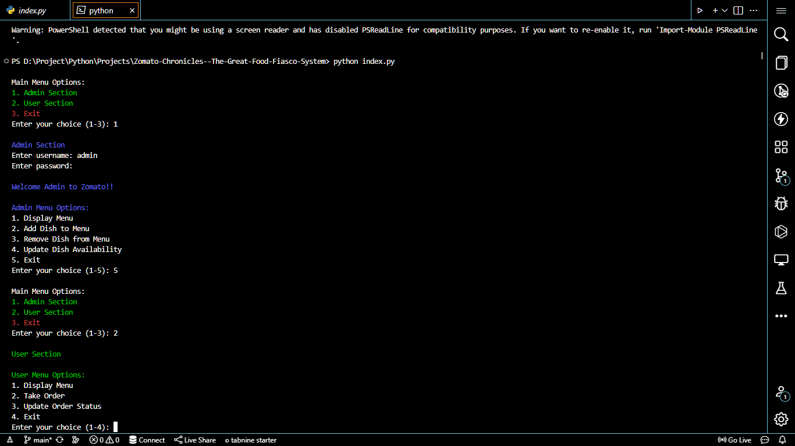

<h1 align="center">Zomato Chronicles: The Great Food Fiasco</h1>

<br>

Once upon a time in the bustling city of Mumbai, there was a newly opened restaurant, "Zesty Zomato", that was swiftly gaining popularity. To further improve their services, they decided to digitize their operations. You, as a brilliant Python developer, have been hired to create a command-line system to help Zesty Zomato manage their food delivery service more effectively and efficiently.

Objective: Your goal is to use Python's core concepts like conditional statements, loops, lists, and dictionaries to develop a robust and interactive system to help Zesty Zomato in their quest for delivering culinary delights to their eager customers.

<br>

## Installation 

```js
git clone https://github.com/Amanmandal-M/Zomato-Chronicles--The-Great-Food-Fiasco-System.git
```

<br>

## Start Project

```js
  python index.py
```

<br>

## All Steps how to start project :

- Clone Repository first
- Open Terminal
- Write command `python index.py`
- Use it by command

Note: 

 - Ensure you successfully installed python on your system or extensions in VSCode.

<br>

<i><strong><h2 align="center">Problem Statement or Informations</h2></strong></i>

<br>

## **Key Features** :

1. **Menu Mastery** : Your system should enable Zesty Zomato to manage their mouth-watering menu of dishes. Each dish will have unique attributes, such as dish ID, dish name, price, and availability (yes or no).

2. **User Interaction Euphoria**: Zesty Zomato staff should be able to perform the following tasks:

    - Add a delicious new dish to the menu.
    - Remove a dish that is no longer served.
    - Update the availability of a dish based on their dynamic kitchen operations.
    - Take a new order from a ravenous customer.
    - Update the status of an order as it goes from 'received' to 'preparing', then 'ready for pickup' and finally 'delivered'.
    - Review all the orders to ensure everything is going as per plan.
    - An exit option to wind up the day's operations.

3. **Taking Orders** : When a customer places an order, Zesty Zomato staff should be able to enter the customer's name and the dish IDs. The system should check whether each dish is available. If so, it should process the order, assigning a unique order ID and setting the initial order status as 'received'.

4. **Order Updates** : When the status of an order changes, staff should be able to enter the unique order ID and update the new status.

5. **Edge Case Excellence** : The system should be smart enough to handle invalid inputs and edge cases, such as ordering a dish that doesn't exist or isn't available.

<br>

## **Extra Adventures**:

For those who finish early or are seeking an extra challenge, consider adding these advanced features:

1. **Price Calculation** : The system should also calculate and display the total price of each order based on the price of each ordered dish.

2. **Status Filter** : Add an option to view only the orders with a certain status (e.g., only the 'ready for pickup' orders).

3. **Data Persistence** : To keep track of the culinary journey, the system should save the menu and order data to a file and load it when the system starts, ensuring data persists across multiple system usages.

<br>

## Ensure the following points during implementation :

1. **Functionality** : Does the program behave as expected, adhering to the requirements, and helping Zesty Zomato manage their operations effectively?

2. **Code Style** : Is the code well-structured into functions? Is the code easy to read and understand, just like a well-presented dish?

3. **Robustness** : Like a versatile chef, does the program handle unexpected or invalid user input gracefully, ensuring the operations run smoothly?

The culinary world of Zesty Zomato is waiting for your command-line system. Unleash your Python skills to create an efficient system that will keep the taste buds of Mumbai satiated. Good luck!

<br>

## Video

[](https://drive.google.com/file/d/173qlCyzbuowsWynEZnK6gmQrBVpasm8l/view)